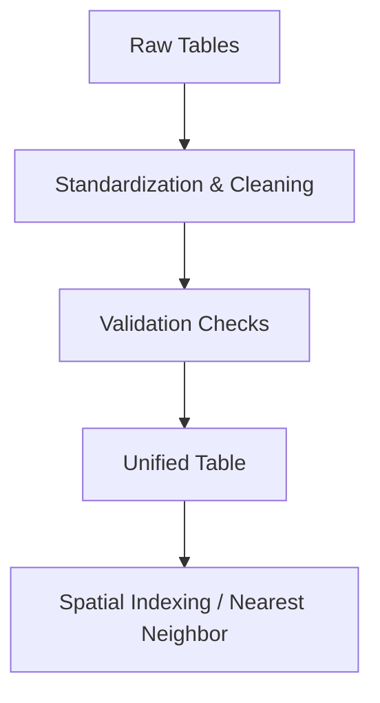

# 📊 Unified Table Data Standardization & Spatial Indexing  
### Data Standardization & Spatial Indexing Project

---

## 🎯 Project Objective
Standardize existing database tables and implement **spatial relationships** between datasets to enable efficient querying and unified analytics.

---

## 🛠️ Tools & Technologies

### 💻 Languages & Libraries
- Python  
- pandas  
- geopandas  

### 🗄️ Databases
- PostgreSQL (with GIST indexes for spatial data)

### 📊 Development Environment
- Jupyter Notebook (data exploration, analysis, and prototyping)

---

## 🔄 Pipeline Overview

### 🧹 Data Standardization
- Cleaned and standardized multiple tables to meet **common schema requirements**  
- Implemented **data validation checks** before table creation  

### 🔗 Data Unification
- Merged transformed tables into a **single consolidated table**  
- Ensured consistency across all datasets for downstream analysis  

### 🌐 Spatial Indexing
- Added **nearest neighbor functionality** to `long_term_listings` table for selected geospatial layers  
- Stored spatial relationships as **JSON documents** using PostgreSQL **GIST indexes** for efficient querying  

---

## 📦 Deliverables
- Table standardization scripts  
- Data unification pipeline  
- Validation framework  
- Spatial indexing implementation  

---

## 🖼️ Workflow Diagram

## 🚀 Highlights

- Unified and standardized datasets for consistent analysis
- Efficient spatial queries enabled via GIST indexes
- Automated pipeline ensures repeatable and scalable workflows
